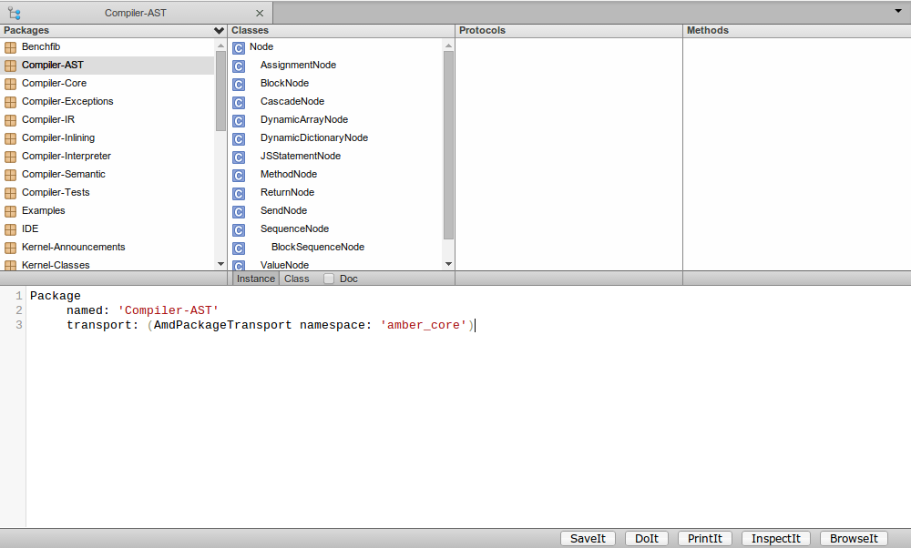
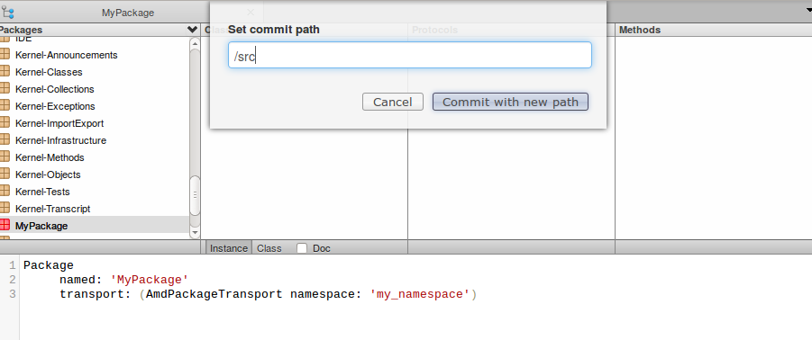

This sections presents an overview of package management with Helios.

This page is a work in progress.

#### Creating packages

Amber packages are created using the package template of Helios.

First go to the package pane in Helios, then change the template
contents to create a new package.  The `namespace:` value of the
`AmdPackageTransport` defines the AMD module bound to the
package. Several packages can use the same AMD namespace.

A namespace represents a module (AMD) name, used by `requirejs` to
load the package in the HTML page (see below). Given that a package
uses an AMD module to be loaded/saved to disk (which is the default),
Helios will use the module path to save the package to disk.

#### Saving packages to disk

The AMD namespace of a package is used by Helios to determine where the
package should be committed to disk.

 If the namespace of a package is not known by Helios,
it will prompt for the path when you will try to save the package for
the first time.  

#### Loading packages

In order to have our extra packages loaded by default in the page, we
have to tell Amber to load the packages. In our `index.html` page we
only load the `amber-devel` module, which contains all core Amber
packages.
